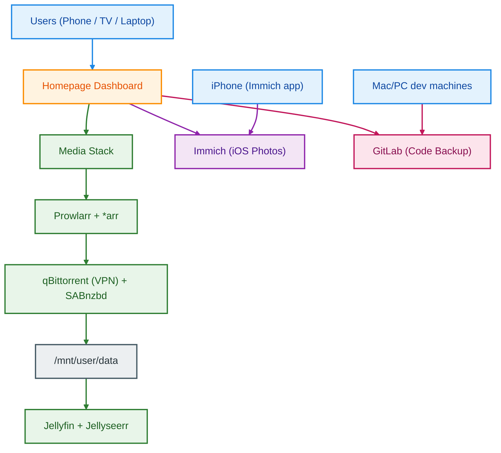

## Ultimate `*arr` Stack on Unraid (Architecture + Runbook)

> Goal: build a reliable, automated media stack for legally obtained content with strong security, clean data flow, and low-maintenance operations.

## 1. Target End State
- One Unraid host runs discovery (`*arr`), download clients, request management, and streaming.
- `Prowlarr` centrally manages indexers and syncs them to all `*arr` apps.
- `Sonarr`/`Radarr`/`Lidarr` automate monitoring + grabbing.
- `qBittorrent` (behind VPN) and `SABnzbd` handle downloading.
- `Bazarr` manages subtitles.
- `Jellyfin` streams media.
- `Jellyseerr` provides request UI for family/friends.
- `Nextcloud` for file sync, `Paperless-ngx` for document management.
- `Immich` for iOS photo backup.
- `GitLab CE` for personal code backup.
- Optional ops tooling: `Recyclarr`, `Unpackerr`, `Grafana + Prometheus + cAdvisor`.

## 2. Architecture (Simplified + Detailed)

### 2.1 Home Lab Overview (Color-Coded)



### 2.2 Detailed `*arr` Flow (Original, Color-Coded)

```mermaid
flowchart LR
    U["Users (TV / Web / Mobile)"] --> JSR["Jellyseerr"]
    JSR --> SA["Sonarr"]
    JSR --> RA["Radarr"]
    SA --> PR["Prowlarr"]
    RA --> PR
    LI["Lidarr"] --> PR
        PR --> IDX["Indexers"]

    SA --> QB["qBittorrent"]
    RA --> QB
    LI --> QB
    
    SA --> SAB["SABnzbd"]
    RA --> SAB
    LI --> SAB
    
    QB --> GL["Gluetun VPN"]
    GL --> NET["Internet"]

    QB --> DATA["/mnt/user/data"]
    SAB --> DATA
    SA --> DATA
    RA --> DATA
    LI --> DATA
        BZ["Bazarr"] --> DATA

    DATA --> JF["Jellyfin"]
    JF --> U

    classDef user fill:#E3F2FD,stroke:#1E88E5,stroke-width:2px,color:#0D47A1;
    classDef request fill:#FFF3E0,stroke:#FB8C00,stroke-width:2px,color:#E65100;
    classDef arr fill:#E8F5E9,stroke:#2E7D32,stroke-width:2px,color:#1B5E20;
    classDef indexer fill:#F3E5F5,stroke:#8E24AA,stroke-width:2px,color:#4A148C;
    classDef download fill:#FBE9E7,stroke:#F4511E,stroke-width:2px,color:#BF360C;
    classDef net fill:#FFEBEE,stroke:#C62828,stroke-width:2px,color:#B71C1C;
    classDef storage fill:#ECEFF1,stroke:#455A64,stroke-width:2px,color:#263238;
    classDef player fill:#E1F5FE,stroke:#0288D1,stroke-width:2px,color:#01579B;
    classDef subtitle fill:#FFF8E1,stroke:#F9A825,stroke-width:2px,color:#F57F17;

    class U user;
    class JSR request;
    class SA,RA,LI,PR arr;
    class IDX indexer;
    class QB,SAB download;
    class GL,NET net;
    class DATA storage;
    class JF player;
    class BZ subtitle;

    linkStyle 0,1,2,26 stroke:#1E88E5,stroke-width:2px;
    linkStyle 3,4,5,6,7 stroke:#8E24AA,stroke-width:2px;
    linkStyle 8,9,10,11,12,13,14,15,16,17 stroke:#F4511E,stroke-width:2px;
    linkStyle 18,19,20,21,22,23,24,25 stroke:#2E7D32,stroke-width:2px;
```

## 3. Core Design Decisions

### 3.1 Keep hardlinks working (critical)
Use **one shared top-level data path** across all apps:
- Host: `/mnt/user/data`
- Container: `/data`

This prevents cross-filesystem moves and enables instant import (hardlink instead of copy).

### 3.2 Split blast radius with network boundaries
- Put only torrent traffic behind VPN (`qBittorrent -> Gluetun`).
- Keep `*arr` + media server on local Docker bridge network.
- Do **not** expose download clients directly to WAN.
- **Critical**: Set `FIREWALL_OUTBOUND_SUBNETS=172.16.0.0/12,192.168.1.0/24` on Gluetun so response traffic reaches Docker containers and LAN. Without this, `*arr` apps get "Connection refused" when connecting to qBittorrent through Gluetun.

### 3.3 Stable IDs/perms on Unraid
Use:
- `PUID=99`
- `PGID=100`
- `UMASK=002`

## 4. Directory Plan

```text
/mnt/user/data/
  downloads/
    torrents/
      incomplete/
      complete/
    usenet/
      incomplete/
      complete/
  media/
    movies/
    tv/
    anime/
    music/

/mnt/user/appdata/
  gluetun/
  qbittorrent/
  sabnzbd/
  prowlarr/
  sonarr/
  radarr/
  lidarr/
  bazarr/
  recyclarr/
  unpackerr/
  jellyfin/
  jellyseerr/
  arr-stack/
```

## 5. Phase 1: Bootstrap Commands (Run on Unraid terminal)

```bash
# Create data + config directories
mkdir -p /mnt/user/data/downloads/torrents/{incomplete,complete}
mkdir -p /mnt/user/data/downloads/usenet/{incomplete,complete}
mkdir -p /mnt/user/data/media/{movies,tv,anime,music,books}

mkdir -p /mnt/user/appdata/{gluetun,qbittorrent,sabnzbd,prowlarr,sonarr,radarr,lidarr,bazarr,recyclarr,unpackerr,jellyfin,jellyseerr,arr-stack}

# Unraid-standard ownership
chown -R 99:100 /mnt/user/data /mnt/user/appdata
chmod -R ug+rwX,o-rwx /mnt/user/appdata
chmod -R ug+rwX,o+rx /mnt/user/data
```

## 6. Phase 2: Environment File
Create `/mnt/user/appdata/arr-stack/.env`:

```bash
cat > /mnt/user/appdata/arr-stack/.env <<'ENV'
PUID=99
PGID=100
TZ=America/Los_Angeles
UMASK=002

# VPN (for Gluetun + qBittorrent)
VPN_SERVICE_PROVIDER=changeme
VPN_COUNTRY=United States
WIREGUARD_PRIVATE_KEY=changeme
WIREGUARD_ADDRESSES=10.64.222.21/32
ENV
```

## 7. Phase 3: Docker Compose Stack
Create `/mnt/user/appdata/arr-stack/docker-compose.yml`:

```yaml
services:
  gluetun:
    image: qmcgaw/gluetun:latest
    container_name: gluetun
    cap_add:
      - NET_ADMIN
    devices:
      - /dev/net/tun:/dev/net/tun
    environment:
      - TZ=${TZ}
      - VPN_SERVICE_PROVIDER=${VPN_SERVICE_PROVIDER}
      - VPN_TYPE=wireguard
      - WIREGUARD_PRIVATE_KEY=${WIREGUARD_PRIVATE_KEY}
      - WIREGUARD_ADDRESSES=${WIREGUARD_ADDRESSES}
      - SERVER_COUNTRIES=${VPN_COUNTRY}
      - FIREWALL_VPN_INPUT_PORTS=8080,6881
      - FIREWALL_INPUT_PORTS=8080,6881
      - FIREWALL_OUTBOUND_SUBNETS=172.16.0.0/12,192.168.1.0/24
      - HTTP_CONTROL_SERVER_ADDRESS=:8000
    ports:
      - "8080:8080"        # qBittorrent web UI via Gluetun
      - "8001:8000"        # Gluetun control server API
      - "6881:6881"
      - "6881:6881/udp"
    volumes:
      - /mnt/user/appdata/gluetun:/gluetun
    restart: unless-stopped

  qbittorrent:
    image: lscr.io/linuxserver/qbittorrent:latest
    container_name: qbittorrent
    network_mode: "service:gluetun"
    depends_on:
      - gluetun
    environment:
      - PUID=${PUID}
      - PGID=${PGID}
      - TZ=${TZ}
      - UMASK=${UMASK}
      - WEBUI_PORT=8080
    volumes:
      - /mnt/user/appdata/qbittorrent:/config
      - /mnt/user/data:/data
    restart: unless-stopped

  sabnzbd:
    image: lscr.io/linuxserver/sabnzbd:latest
    container_name: sabnzbd
    ports:
      - "8085:8080"
    environment:
      - PUID=${PUID}
      - PGID=${PGID}
      - TZ=${TZ}
      - UMASK=${UMASK}
    volumes:
      - /mnt/user/appdata/sabnzbd:/config
      - /mnt/user/data:/data
    restart: unless-stopped

  prowlarr:
    image: lscr.io/linuxserver/prowlarr:latest
    container_name: prowlarr
    ports:
      - "9696:9696"
    environment:
      - PUID=${PUID}
      - PGID=${PGID}
      - TZ=${TZ}
      - UMASK=${UMASK}
    volumes:
      - /mnt/user/appdata/prowlarr:/config
    restart: unless-stopped

  sonarr:
    image: lscr.io/linuxserver/sonarr:latest
    container_name: sonarr
    ports:
      - "8989:8989"
    environment:
      - PUID=${PUID}
      - PGID=${PGID}
      - TZ=${TZ}
      - UMASK=${UMASK}
    volumes:
      - /mnt/user/appdata/sonarr:/config
      - /mnt/user/data:/data
    restart: unless-stopped

  radarr:
    image: lscr.io/linuxserver/radarr:latest
    container_name: radarr
    ports:
      - "7878:7878"
    environment:
      - PUID=${PUID}
      - PGID=${PGID}
      - TZ=${TZ}
      - UMASK=${UMASK}
    volumes:
      - /mnt/user/appdata/radarr:/config
      - /mnt/user/data:/data
    restart: unless-stopped

  lidarr:
    image: lscr.io/linuxserver/lidarr:latest
    container_name: lidarr
    ports:
      - "8686:8686"
    environment:
      - PUID=${PUID}
      - PGID=${PGID}
      - TZ=${TZ}
      - UMASK=${UMASK}
    volumes:
      - /mnt/user/appdata/lidarr:/config
      - /mnt/user/data:/data
    restart: unless-stopped

  bazarr:
    image: lscr.io/linuxserver/bazarr:latest
    container_name: bazarr
    ports:
      - "6767:6767"
    environment:
      - PUID=${PUID}
      - PGID=${PGID}
      - TZ=${TZ}
      - UMASK=${UMASK}
    volumes:
      - /mnt/user/appdata/bazarr:/config
      - /mnt/user/data:/data
    restart: unless-stopped

  recyclarr:
    image: ghcr.io/recyclarr/recyclarr:latest
    container_name: recyclarr
    environment:
      - TZ=${TZ}
    volumes:
      - /mnt/user/appdata/recyclarr:/config
    restart: unless-stopped

  unpackerr:
    image: golift/unpackerr:latest
    container_name: unpackerr
    environment:
      - TZ=${TZ}
      - UN_SONARR_0_URL=http://sonarr:8989
      - UN_RADARR_0_URL=http://radarr:7878
      # Add API keys after first-time setup.
    volumes:
      - /mnt/user/data:/data
    restart: unless-stopped

  jellyfin:
    image: lscr.io/linuxserver/jellyfin:latest
    container_name: jellyfin
    ports:
      - "8096:8096"
      - "8920:8920"
    environment:
      - PUID=${PUID}
      - PGID=${PGID}
      - TZ=${TZ}
      - UMASK=${UMASK}
    volumes:
      - /mnt/user/appdata/jellyfin:/config
      - /mnt/user/data/media:/data/media
    restart: unless-stopped

  jellyseerr:
    image: fallenbagel/jellyseerr:latest
    container_name: jellyseerr
    ports:
      - "5055:5055"
    environment:
      - TZ=${TZ}
    volumes:
      - /mnt/user/appdata/jellyseerr:/app/config
    restart: unless-stopped
```

## 8. Phase 4: Deploy Commands

```bash
cd /mnt/user/appdata/arr-stack

# Validate compose syntax
docker compose config >/dev/null

# Pull latest images
docker compose --env-file .env pull

# Start stack
docker compose --env-file .env up -d

# Verify running
docker compose ps
docker ps --format 'table {{.Names}}\t{{.Status}}\t{{.Ports}}'
```

## 9. Phase 5: First-Time App Configuration (Order Matters)

### 9.1 qBittorrent
- Open: `http://192.168.1.100:8080`
- Set categories + save paths:
  - `tv` -> `/data/downloads/torrents/complete/tv`
  - `movies` -> `/data/downloads/torrents/complete/movies`
  - `music` -> `/data/downloads/torrents/complete/music`
  - `books` -> `/data/downloads/torrents/complete/books`
- Enable incomplete path: `/data/downloads/torrents/incomplete`

### 9.2 SABnzbd
- Open: `http://192.168.1.100:8085`
- Temporary/incomplete: `/data/downloads/usenet/incomplete`
- Complete: `/data/downloads/usenet/complete`
- Create categories matching your `*arr` apps.

### 9.3 Prowlarr
- Open: `http://192.168.1.100:9696`
- Add indexers.
- Add apps and sync indexers:
  - Sonarr: `http://sonarr:8989`
  - Radarr: `http://radarr:7878`
  - Lidarr: `http://lidarr:8686`

### 9.4 Sonarr / Radarr / Lidarr
- Root folders:
  - Sonarr -> `/data/media/tv`
  - Radarr -> `/data/media/movies`
  - Lidarr -> `/data/media/music`
- Download clients:
  - qBittorrent: `http://gluetun:8080` (or host IP + 8080)
  - SABnzbd: `http://sabnzbd:8080`
- Enable Completed Download Handling in each app.

### 9.5 Bazarr
- Open: `http://192.168.1.100:6767`
- Connect to Sonarr + Radarr.
- Set subtitle languages + score profiles.

### 9.6 Jellyfin + Jellyseerr
- Jellyfin: `http://192.168.1.100:8096` and add libraries from:
  - `/data/media/movies`
  - `/data/media/tv`
  - `/data/media/music`
- Jellyseerr: `http://192.168.1.100:5055`, link Jellyfin and Sonarr/Radarr.

## 10. Critical Validation Commands

```bash
# 1) VPN is actually used by qBittorrent
docker exec gluetun wget -qO- https://ipinfo.io/ip

# 2) Hardlink test (must show same inode numbers)
truncate -s 1M /mnt/user/data/downloads/torrents/complete/hardlink.test
ln /mnt/user/data/downloads/torrents/complete/hardlink.test /mnt/user/data/media/movies/hardlink.test
ls -li /mnt/user/data/downloads/torrents/complete/hardlink.test /mnt/user/data/media/movies/hardlink.test

# 3) Reachability checks
curl -I http://127.0.0.1:9696
curl -I http://127.0.0.1:8989
curl -I http://127.0.0.1:7878
curl -I http://127.0.0.1:8096
```

## 11. Security Hardening Checklist
- Keep all app UIs on LAN only; remote access via VPN (Tailscale/WireGuard) or reverse proxy + auth.
- Never expose qBittorrent/SABnzbd admin ports directly to the internet.
- Set strong unique credentials on every app.
- Rotate API keys if shared accidentally.
- Keep Unraid and container images updated monthly.
- Back up `/mnt/user/appdata` and critical media metadata.

## 12. Backup and Update Runbook

### 12.1 Backup app configs
```bash
mkdir -p /mnt/user/backups/appdata
rsync -a --delete /mnt/user/appdata/ /mnt/user/backups/appdata/latest/
tar -czf /mnt/user/backups/appdata/appdata-$(date +%F).tgz -C /mnt/user/backups/appdata latest
```

### 12.2 Update stack safely
```bash
cd /mnt/user/appdata/arr-stack
docker compose --env-file .env pull
docker compose --env-file .env up -d

docker image prune -f
```

## 13. Optional “Ultimate” Upgrades
- Add `Autobrr` for release push automation.
- Add `Notifiarr` for alerting.
- Use `Recyclarr` custom formats/quality profiles from Trash Guides.
- Add `Tdarr` for transcoding optimization.
- Add `Grafana + Prometheus + cAdvisor` for full observability.

## 14. Troubleshooting Quick Hits
- Imports are copying (not hardlinking): all paths must be under the same `/mnt/user/data` share in every container.
- Downloads stuck in queue: check indexer health in Prowlarr and download client auth.
- No remote requests processing: re-check Jellyseerr API links to Sonarr/Radarr.
- Permission errors: verify `PUID/PGID` per container. Note that different services require different UIDs: linuxserver.io containers use 99:100, Nextcloud uses 33:33 (www-data), MariaDB/Postgres use 999:999, GitLab uses 998:998 (git).
- Gluetun "Connection refused" from `*arr` apps: ensure `FIREWALL_OUTBOUND_SUBNETS` includes Docker and LAN subnets.
- Nextcloud 403/503: check ownership of `/mnt/user/appdata/nextcloud` and `/mnt/user/data/nextcloud` (must be 33:33).
- Paperless 500: ensure `PAPERLESS_SECRET_KEY` is set in environment.

## 15. Final Notes
- Build in phases: deploy core stack first (`prowlarr`, `sonarr`, `radarr`, `qbittorrent`, `jellyfin`), then add optional services.
- Treat this as infrastructure: document changes, back up configs, and keep update cadence consistent.

## 16. Dashboard (to track all services)

Recommended: `Homepage` (fast, clean, good Docker widgets).

### 16.1 Add to Docker Compose
Add this service under `services:` in your compose file:

```yaml
  homepage:
    image: ghcr.io/gethomepage/homepage:latest
    container_name: homepage
    ports:
      - "3001:3000"
    environment:
      - TZ=${TZ}
      - PUID=${PUID}
      - PGID=${PGID}
    volumes:
      - /mnt/user/appdata/homepage:/app/config
      - /var/run/docker.sock:/var/run/docker.sock:ro
      - /mnt/user/data:/data:ro
    restart: unless-stopped
```

### 16.2 Create dashboard config

```bash
mkdir -p /mnt/user/appdata/homepage

cat > /mnt/user/appdata/homepage/settings.yaml <<'YAML'
title: Home Server
color: slate
headerStyle: boxed
YAML

cat > /mnt/user/appdata/homepage/services.yaml <<'YAML'
- Media:
    - Jellyfin:
        href: http://192.168.1.100:8096
        description: Streaming
        icon: jellyfin
    - Jellyseerr:
        href: http://192.168.1.100:5055
        description: Requests
        icon: jellyseerr

- Arr Stack:
    - Prowlarr:
        href: http://192.168.1.100:9696
        icon: prowlarr
    - Sonarr:
        href: http://192.168.1.100:8989
        icon: sonarr
    - Radarr:
        href: http://192.168.1.100:7878
        icon: radarr
    - Lidarr:
        href: http://192.168.1.100:8686
        icon: lidarr
    - Bazarr:
        href: http://192.168.1.100:6767
        icon: bazarr

- Download:
    - qBittorrent:
        href: http://192.168.1.100:8080
        icon: qbittorrent
    - SABnzbd:
        href: http://192.168.1.100:8085
        icon: sabnzbd
YAML

cat > /mnt/user/appdata/homepage/widgets.yaml <<'YAML'
- resources:
    cpu: true
    memory: true
    disk: /

- search:
    provider: duckduckgo
    target: _blank
YAML

cat > /mnt/user/appdata/homepage/bookmarks.yaml <<'YAML'
- Admin:
    - Unraid:
        href: https://192.168.1.100
YAML
```

### 16.3 Deploy dashboard

```bash
cd /mnt/user/appdata/arr-stack
docker compose --env-file .env up -d homepage
```

Access dashboard at: `http://192.168.1.100:3001`

## 17. Security Model: local stack vs VPS reverse proxy

### Short answer
- Yes, keeping the full stack local is the safest default.
- No, you do **not** need a reverse proxy on VPS/EC2 for this setup.

### Recommended remote access order
1. Best: VPN to home network (`Tailscale` or your own WireGuard). No public exposure of app panels.
2. Next best: local reverse proxy on Unraid (`Caddy`, `Traefik`, or `Nginx Proxy Manager`) with HTTPS + SSO/2FA.
3. Public internet exposure of `*arr` and download clients is not recommended.

### When VPS/EC2 reverse proxy is useful
Use VPS/EC2 only if you have a specific need (static public egress, geo routing, advanced relay). For most home servers, it adds complexity and attack surface without real security benefit.

### Non-negotiable rules
- Keep `qBittorrent` and `SABnzbd` private.
- Disable UPnP on router unless you specifically need it.
- Use unique strong passwords and rotate API keys.
- Keep WAN open ports to the minimum (ideally none, if using Tailscale).

## 18. Add Local iOS Photo Backup (Immich)

Use `Immich` for iPhone photo/video auto-backup to your Unraid storage.

### 18.1 Create storage + config paths

```bash
mkdir -p /mnt/user/data/photos/library
mkdir -p /mnt/user/appdata/immich/{postgres,model-cache}
chown -R 99:100 /mnt/user/data/photos /mnt/user/appdata/immich
```

### 18.2 Create Immich env file
Create `/mnt/user/appdata/immich/.env`:

```bash
cat > /mnt/user/appdata/immich/.env <<'ENV'
TZ=America/Los_Angeles

# Immich data locations
UPLOAD_LOCATION=/mnt/user/data/photos/library
DB_DATA_LOCATION=/mnt/user/appdata/immich/postgres
MODEL_CACHE_LOCATION=/mnt/user/appdata/immich/model-cache

# Database settings
DB_USERNAME=postgres
DB_PASSWORD=change_me_to_a_long_random_password
DB_DATABASE_NAME=immich
ENV
```

### 18.3 Add Immich services to arr-stack compose
Add these under `services:` in `/mnt/user/appdata/arr-stack/docker-compose.yml`:

```yaml
  immich-server:
    container_name: immich_server
    image: ghcr.io/immich-app/immich-server:release
    depends_on:
      - immich-redis
      - immich-postgres
    env_file:
      - /mnt/user/appdata/immich/.env
    ports:
      - "2283:2283"
    volumes:
      - /etc/localtime:/etc/localtime:ro
      - /mnt/user/data/photos/library:/usr/src/app/upload
    restart: unless-stopped

  immich-machine-learning:
    container_name: immich_machine_learning
    image: ghcr.io/immich-app/immich-machine-learning:release
    env_file:
      - /mnt/user/appdata/immich/.env
    volumes:
      - /mnt/user/appdata/immich/model-cache:/cache
    restart: unless-stopped

  immich-redis:
    container_name: immich_redis
    image: redis:7-alpine
    restart: unless-stopped

  immich-postgres:
    container_name: immich_postgres
    image: postgres:16
    environment:
      - POSTGRES_USER=postgres
      - POSTGRES_PASSWORD=change_me_to_a_long_random_password
      - POSTGRES_DB=immich
    volumes:
      - /mnt/user/appdata/immich/postgres:/var/lib/postgresql/data
    restart: unless-stopped
```

### 18.4 Deploy Immich

```bash
cd /mnt/user/appdata/arr-stack
docker compose --env-file .env up -d immich-postgres immich-redis immich-server immich-machine-learning
docker compose ps
```

Access: `http://192.168.1.100:2283`

### 18.5 iPhone setup
- Install Immich iOS app.
- Server URL: `http://192.168.1.100:2283`
- Create account, enable Background Backup, and allow Photos permissions.
- Keep app refresh/background tasks enabled in iOS settings.

## 19. Add GitLab for Personal Code Backup

`GitLab CE` works well for private code backup and self-hosted remotes.

### 19.1 Resource expectation
- Minimum: ~4 GB RAM dedicated.
- Better experience: 6-8 GB RAM.

### 19.2 Create GitLab paths

```bash
mkdir -p /mnt/user/appdata/gitlab/{config,logs,data}
chown -R 99:100 /mnt/user/appdata/gitlab
```

### 19.3 Create dedicated GitLab compose
Create `/mnt/user/appdata/gitlab/docker-compose.yml`:

```yaml
services:
  gitlab:
    image: gitlab/gitlab-ce:latest
    container_name: gitlab
    hostname: gitlab.local
    environment:
      GITLAB_OMNIBUS_CONFIG: |
        external_url 'http://192.168.1.100:8929'
        gitlab_rails['gitlab_shell_ssh_port'] = 2424
    ports:
      - "8929:8929"
      - "2424:22"
    volumes:
      - /mnt/user/appdata/gitlab/config:/etc/gitlab
      - /mnt/user/appdata/gitlab/logs:/var/log/gitlab
      - /mnt/user/appdata/gitlab/data:/var/opt/gitlab
    shm_size: "256m"
    restart: unless-stopped
```

### 19.4 Deploy GitLab

```bash
cd /mnt/user/appdata/gitlab
docker compose up -d

docker logs -f --tail 200 gitlab
```

GitLab UI: `http://192.168.1.100:8929`

### 19.5 Get initial root password

```bash
docker exec -it gitlab grep 'Password:' /etc/gitlab/initial_root_password
```

### 19.6 Push local repos to GitLab backup remote

```bash
# Inside each local repo
git remote add homelab "ssh://git@192.168.1.100:2424/<gitlab-username>/<repo>.git"
git push -u homelab --all
git push -u homelab --tags
```

## 20. Add Immich + GitLab to Homepage Dashboard

Add these blocks to `/mnt/user/appdata/homepage/services.yaml`:

```yaml
- Photos:
    - Immich:
        href: http://192.168.1.100:2283
        description: iOS photo backup
        icon: immich

- Dev:
    - GitLab:
        href: http://192.168.1.100:8929
        description: Personal git backup
        icon: gitlab
```

Then reload dashboard:

```bash
cd /mnt/user/appdata/arr-stack
docker compose --env-file .env restart homepage
```

## 21. Security Notes for New Services
- Keep `Immich` and `GitLab` LAN-only by default.
- For remote access, use Tailscale/WireGuard rather than open WAN ports.
- Enable 2FA in GitLab once admin setup is complete.
- Use strong random passwords for Immich and GitLab admin accounts.
- Include `/mnt/user/appdata/gitlab` and `/mnt/user/data/photos` in your backup set.
